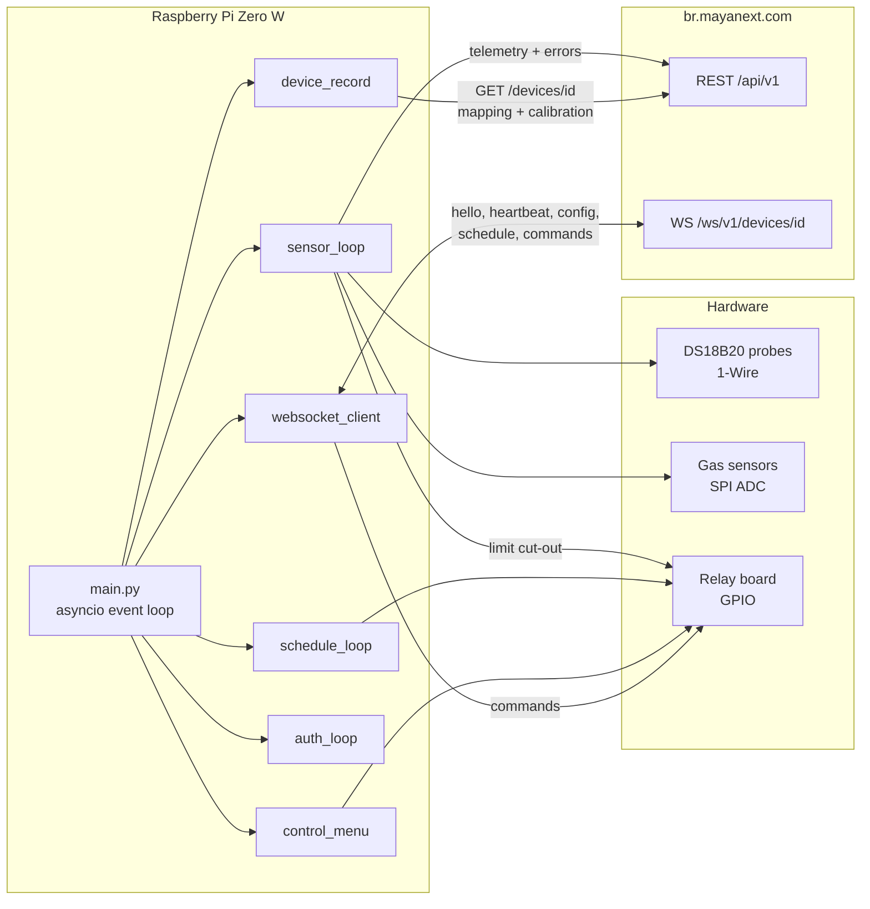
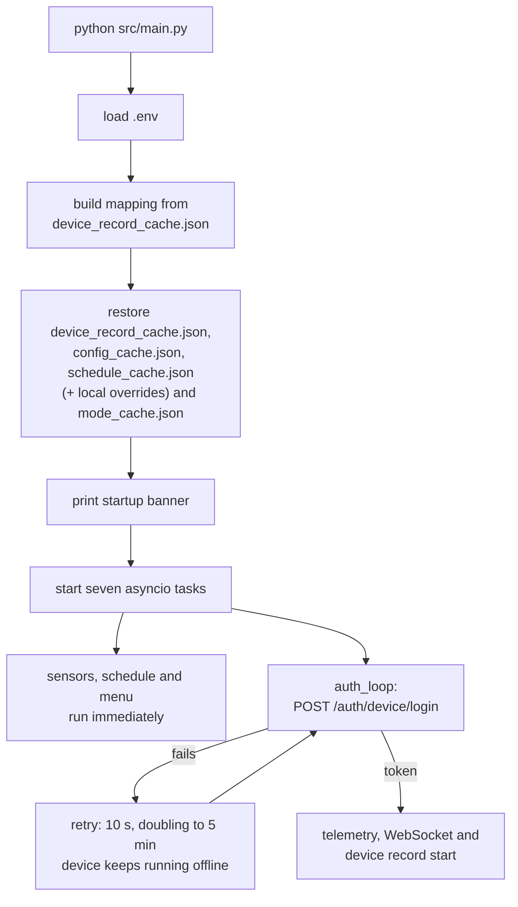
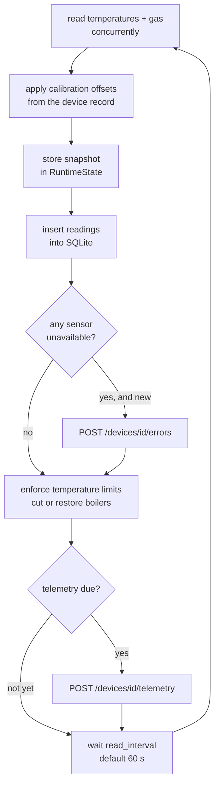
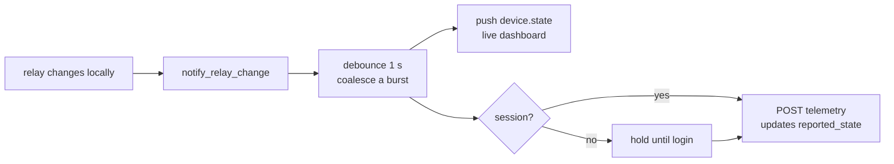
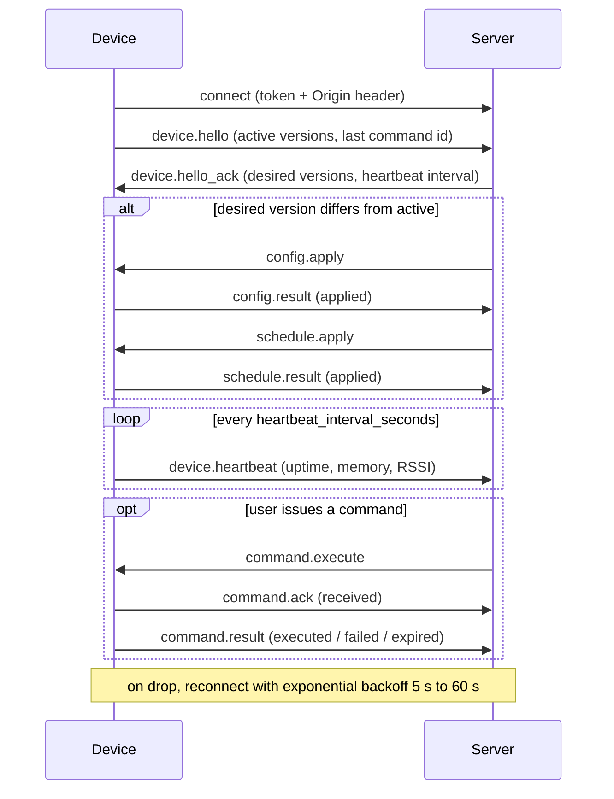
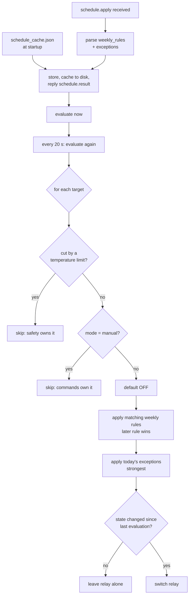
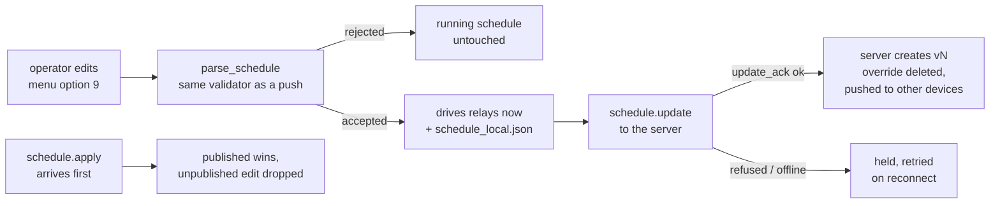
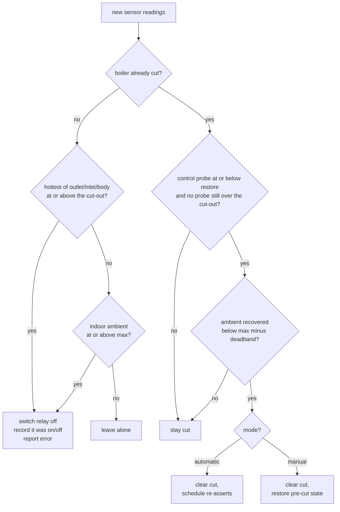

# boilerRoom-edge

Edge agent for the Smart Boiler Room platform. It runs on a Raspberry Pi in the
boiler room, reads temperature and gas sensors, drives relays, and keeps a live
link to the cloud over REST and WebSockets.

Server-side API contract: [`DEVICE.md`](DEVICE.md).

- **Target hardware:** Raspberry Pi Zero W — single-core ARMv6, 512 MB RAM, SD card
- **Python:** 3.11+ (uses `datetime.UTC`)
- **Dependencies:** `websockets`, `tzdata` (plus `RPi.GPIO` and `spidev` on real hardware)
- **Concurrency:** one asyncio event loop; every blocking call goes through
  `asyncio.to_thread` so nothing stalls the loop

---

## System overview



Seven tasks run concurrently for the life of the process:

| Task | Responsibility |
|------|----------------|
| `sensor_loop` | Read all sensors, store history, report faults, enforce temperature limits, post telemetry |
| `websocket_client` | Realtime channel: hello, heartbeat, config, schedule, commands |
| `schedule_loop` | Re-evaluate the active schedule every 20 s and switch relays |
| `control_menu` | Interactive terminal menu for local inspection and control |
| `auth_loop` | Obtain a device session, retrying in the background until it succeeds |
| `device_record` | Poll `GET /devices/<id>` for calibration, sensor enable flags and cloud intent |
| `state_publisher` | Report local relay changes to the server at once, instead of at the next post |

---

## Startup



**Startup never depends on the server being reachable.** Login runs as a
background task, so a boiler room that reboots during an outage still comes up
and runs its heating programme from the cached schedule. Telemetry and the
WebSocket wait on the session rather than blocking the boot; sensor polling,
schedule control, limit enforcement, reading history, and the control menu all
work without one. Missing credentials are reported once and not retried, since no
amount of waiting will supply them.

The device session token is used for **both** REST
(`Authorization: Device <token>`) and the WebSocket. There is no refresh
endpoint for devices — when the token nears expiry, or the server answers 401,
the agent simply logs in again.

---

## Sensor cycle



Limits are enforced *before* telemetry is built, so a cut is reported in the
same cycle it happens.

Telemetry is posted **once a minute**, and sensors are read on the same
one-minute cycle. `telemetry_interval_seconds` from the server config overrides
the posting cadence once one has been received.

The due-check runs with a few seconds of slack, because it only happens on
read-cycle boundaries. With the read interval equal to the telemetry interval,
a cycle landing a second early would fail a strict comparison and defer the
post to the next cycle — quietly turning a one-minute cadence into two.

The first cycle after boot posts immediately rather than waiting out the
interval, so a restart is visible on the server straight away.

Measured cadence over a five-post run: 59.4, 60.8, 61.0, 60.7 s. The server
records `captured_at` from the payload, so the spacing is recorded accurately
rather than assumed.

> **The read interval also bounds how fast the over-temperature cut reacts.**
> The limit guard runs once per sensor cycle, so at 60 s a boiler can sit over
> its maximum for up to a minute before being switched off — it was 10 s
> before. If that latency matters for your installation, either lower
> `DEFAULT_READ_INTERVAL` or give the limit guard its own faster poll.

The envelope follows the schema in `DEVICE.md`: `sensor_readings` with
`value`/`unit`/`status`, `boiler_states` and `pump_states` with `state` and
`mode`, the active config and schedule versions, `uptime_seconds`, and
`network` (`type`, `rssi_dbm`) where the host exposes a wireless interface.
Readings also carry `role`, `boiler_index`, and `equipment_unit` — additive
fields outside the documented schema that let the server correlate a reading
with the physical installation.

`errors` is deliberately **not** included. Errors go to
`POST /devices/<id>/errors`, where each entry is documented to become an alert;
repeating them in telemetry risks duplicates, and an empty `errors: []` on a
device that has just reported a fault would be misleading.

`device_status` is `normal`, `degraded` (a sensor is unavailable), or `unknown`
(no readings yet). The server stores this string without validating it, so the
vocabulary in `DEVICE.md` is the only guide.

### Reporting local relay changes

A unit's `reported_state` on the server comes from telemetry `boiler_states` /
`pump_states` and from nothing else. Waiting for the next scheduled post made
local changes take up to a minute to appear, while a change made *from* the
cloud arrived instantly as a WebSocket command — an asymmetry that looked like
a bug from the dashboard.

So anything that switches a relay locally — the control menu, a schedule
transition, a temperature cut, an executed command — announces it, and the
`state_publisher` task posts telemetry straight away:



Two limits keep this cheap on a Pi Zero W, where every POST costs a TLS
handshake on one ARMv6 core: a **1 s debounce**, so a schedule tick switching
four relays sends one post, and a **5 s floor** between change-driven posts, so
a burst of toggles cannot become a stream of handshakes. The regular cadence is
untouched, and an immediate post resets the interval clock so the sensor loop
does not duplicate it.

`device.state` goes out alongside, over the already-open WebSocket. It is not a
substitute: `DEVICE.md` defines it as a live dashboard push
(`dashboard.state_changed`), and only telemetry settles the stored
`reported_state`.

A change made before login is **held**, not dropped — at boot the schedule
switches relays a second or two before the session exists.

Measured end to end: an operator toggle through the control menu reached the
server **1.4 s** later; relay changes at boot, **1.9 s**. Both were 60–70 s
before.

### When a post fails: the outbox

A failed telemetry post used to be gone — logged, and the readings never sent.
Now the envelope is written to a `telemetry_outbox` table with
`sync_to_server = 0` and retried later. It is replayed **verbatim**, so its
original `captured_at` is what the server records: the history shows when the
readings were taken, not when the link came back.

```sql
telemetry_outbox(id, captured_at, envelope, sync_to_server,
                 attempts, last_error, queued_at, synced_at)
```

On a successful replay the row flips to `sync_to_server = 1` with `synced_at`
stamped, and ages out with the readings under the same retention window.

**Ordering is the subtle part.** `boiler_states` / `pump_states` set the
server's `reported_state`, so a queued envelope delivered *after* a newer one
would rewind the cloud's view of the relays. Two rules prevent it:

* every send goes through one lock, and the backlog drains oldest-first
  before the live post;
* if the backlog cannot be drained, the live envelope is **queued too** rather
  than sent ahead of it.

The queue drains at 10 envelopes per send — each is a separate TLS handshake on
one ARMv6 core, so a day's outage clears in roughly two hours instead of
monopolising a cycle. Two limits keep a long outage from taking the card with
it: `BOILERROOM_OUTBOX_MAX_PENDING` (5,000 rows, about 7 MB and three days)
drops the oldest on overflow, and `BOILERROOM_OUTBOX_MAX_ATTEMPTS` (5) sets a
row aside so one envelope the server always rejects cannot block everything
behind it. Set-aside rows show as `stuck` in menu option 3.

Verified against the live server: an envelope queued with a `captured_at` ten
minutes in the past was replayed and the server stored it under that original
timestamp, not the delivery time.

---

## WebSocket session



The session is long-lived: it stays open and is kept alive by the heartbeat at
the interval `hello_ack` asks for (30 s). Reconnects back off exponentially from
5 s to 60 s, resetting once a session has survived 30 s — each attempt costs a
full TLS handshake, which is expensive on the Pi Zero W's single ARMv6 core, so
a server that rejects connections must not turn into a reconnect storm.

**Origin header is required.** The server runs Channels'
`AllowedHostsOriginValidator`, which rejects a handshake carrying no `Origin`
with `HTTP 403` *before* authentication is checked. Non-browser clients send
none by default, so the agent always sends one (`BOILERROOM_WS_ORIGIN`).

Implemented messages:

| Direction | Messages |
|-----------|----------|
| Device → server | `device.hello`, `device.heartbeat`, `command.ack`, `command.result`, `config.result`, `schedule.result`, `schedule.update`, `boiler.set_temperature`, `device.state` |
| Server → device | `device.hello_ack`, `config.apply`, `schedule.apply`, `schedule.update_ack`, `boiler.set_temperature_ack`,
`boiler.apply_temperature`, `command.execute` |

`schedule.update` is the one message the device sends that *changes* cloud
state: it publishes a schedule edited on the device, and the server answers
`schedule.update_ack` with the version it created. See
[Changing the programme on the device](#changing-the-programme-on-the-device).

Supported commands: `boiler.turn_on/off`, `boiler.set_mode`,
`boiler.set_temperature`, `pump.turn_on/off`,
`pump.set_mode`, `device.request_state`, `device.restart_service`,
`alarm.acknowledge_local`.

Command outcomes are cached by `command_id` (last 64) and replayed rather than
re-executed, because the server re-dispatches queued commands after every hello.

### Reconciliation after hello

A device is expected to run through outages, so the two sides drift apart on
purpose: the boiler room keeps working from its caches and an operator can
change things at the panel, while someone in the app changes the same things.
When the link comes back, `reconcile.py` decides whose version stands. It runs
alongside the listen loop — the pushes it waits for arrive there — and one step
failing does not stop the rest.

| # | Step | Rule |
|---|------|------|
| 1 | Config and schedule versions | `hello_ack` names the versions the server wants; wait up to 20 s for it to push anything newer |
| 2 | Device record | Re-fetch `GET /devices/<id>` — modes, setpoints, calibration, enabled probes, wiring |
| 3 | Local changes | Publish whatever this device changed offline and the server has not heard about |
| 4 | Thermal backlog | Drain the telemetry outbox, oldest first, within a 60 s budget |
| 5 | Relay state | Assert where the relays actually are |

**What "newer" can mean.** Only schedule and config are datable: they carry
integer versions minted by the server, so newest-wins is a real comparison.
Modes and setpoints carry no version and no timestamp anywhere — not in the
unit record, not in telemetry, not on the device — so for those the rule is the
one thing that *is* known: a change this device has not managed to send yet is
newer by definition, because the server has never heard of it. It wins and is
published; anything else, the record wins. If the platform ever adds an
`updated_at` to a unit, `record_sync.adopt_record_modes` is where that becomes
a real comparison.

A device can never legitimately hold a *higher* version than the server, since
the server mints them — that means a rollback or a lost version, and is
reported rather than fought. The real "the device has something newer" case is
a local edit, which keeps the published version number on purpose.

**Step order is the point.** Take the case this exists for: the device edited
its schedule at 12:05, the server published a newer one at 18:00. Publishing
the local edit first would make the stale 12:05 edit the room's real schedule
and destroy the 18:00 one — the device winning by speaking first rather than by
being right. So versions settle first, the newer push supersedes and deletes
the local override, and only what survives that is offered upstream.

Relay wiring, calibration and enabled probes are server-owned — the device
cannot author them, so the record simply wins. Relay on/off is the opposite:
the device owns it physically and DEVICE.md has `reported_state` come from
telemetry and nothing else, so step 5 asserts rather than asks. The cloud's
`desired_state` does not get to overrule a safety cut.

---

## Schedule evaluation



Two properties worth knowing:

- **Edge-triggered.** A relay is switched only when the computed state
  *changes*. A manual toggle from the control menu therefore survives until the
  next schedule transition instead of being reverted seconds later.
- **Mode-gated.** A unit in `manual` is out of schedule control entirely;
  `automatic` hands it back and re-asserts immediately.

Targets map to relays through the device mapping: boiler *N* → unit `pot_N` → the
relay with role `pot`; pump *N* → the relay with role `pump`.

### Changing the programme on the device

Schedules are published from the cloud, but an operator standing in the boiler
room has to be able to change how the boilers run without it — the same
argument that put control modes on the device. A site whose uplink is dead, or
a room being commissioned before anything has been published, still needs its
programme in someone's hands.

**Control-menu option 9** adds and removes weekly rules and date exceptions:

```
--- Change schedule ---
  1) Add a weekly rule        4) Remove a date exception
  2) Remove a weekly rule     5) Discard local edits
  3) Add a date exception     0) Back
```

An edit is a mutation of the raw `schedule.apply` document, handed straight to
`parse_schedule` — so a programme built here passes exactly the checks a server
push does, and a rejected edit leaves the running schedule untouched. There is
no second, weaker validator to drift out of step. A device with no schedule at
all starts one from scratch at version 0.



**The edit is offered upstream.** `schedule.update` (DEVICE.md) hands the new
weekly rules to the server, which creates a schedule version for the room, sets
it desired *and* applied, sets this device's `active_schedule_version`, and
pushes `schedule.apply` to the room's **other** devices. At that point the edit
is not local at all — it is the room's schedule:

```
[menu] Schedule updated — 06:00-08:30 mon,tue -> ON for boiler 1, pump 1.
[menu] Publishing to the server ...
[menu] Published — the server created schedule v34. This is now the room's
       schedule, not a local edit.
```

Everything else here is what happens **until that succeeds**, which matters
because the device is built to run through outages:

- the edit drives the relays immediately, published or not;
- it is held as an override on the last published version in
  `schedule_local.json`, and **retried on the next connection** — a programme
  changed during an outage is offered as soon as the WebSocket returns;
- while unpublished the device keeps reporting the *published*
  `schedule_version`. Bumping it would make the server spot a mismatch at the
  next hello and push its own schedule back, wiping the change before it could
  be offered;
- a `schedule.apply` arriving first **supersedes an unpublished edit** and
  deletes the override — the room's owner published something, and that
  outranks an edit that never made it up. Logged at WARNING, never quiet.

A refused `schedule.update` (an unpaired device, say) and a missing ack are
treated identically: the change keeps running locally and is offered again
later. Nothing is dropped on either path. While an edit is unpublished it is a
divergence the server cannot see, so the menu header, a WARNING on every edit
and every boot, and `schedule_locally_modified` on `device.state` all surface it.


**Edits survive a restart.** They are written to `schedule_local.json`,
atomically, separately from `schedule_cache.json` — the published document has
to stay intact for "discard local edits" to have something to put back. At boot
the override is restored only while it still sits on the version it was made
against; if the server published something newer while the device was off, that
publish outranks the edits and they are dropped with a line saying so. A cache
that cannot be *written* logs a warning and the edit still takes effect — it
simply will not survive a restart, which the menu says at the time.

```
schedule_local.json
{"saved_at": "...", "based_on_version": 25, "revision": 3, "schedule": { ... }}
```

Exceptions added here are numbered `local-1`, `local-2` …, so an operator can
tell their own one-offs from the ones that came down with a published schedule.
Each prompt is a blocking read that can sit for minutes, so the schedule is
re-checked before an edit is applied: if a push landed while you were typing,
nothing is saved and the menu says so rather than silently undoing it.

### Control modes

Every boiler and pump is in one of two modes, **per unit** — there is no
device-wide switch, so boiler 1 can be under maintenance while boiler 2 follows
the programme:

| Mode | Who drives the relay |
|------|----------------------|
| `automatic` (default) | The schedule |
| `manual` | Commands only — the schedule leaves it alone |

Set either from the server (`boiler.set_mode` / `pump.set_mode`) or **on the
device** through control-menu option 7 — an operator standing in the boiler
room should not need the cloud to take a boiler off the schedule. Both paths
drive the unit identically, persist the same way, and are reported to the
server within a second or two. Switching back to `automatic` calls `forget()` so the schedule
re-asserts on the next tick rather than waiting for the next start/end
boundary. The limit guard respects the mode too:
after a cut clears, a manual unit is put back exactly where the operator left
it, while an automatic one is handed to the schedule.

#### Keeping modes in step with the server

Modes move in both directions, and neither uses the same channel as everything
else.

**Down — the server's mode reaches the device through `GET /devices/<id>`.**
Nothing on the WebSocket carries current modes: `hello_ack` has versions and a
heartbeat interval, and after hello the server re-dispatches only commands
still `queued`/`sent`, so a mode whose command completed long ago never
arrives again. Each device-record poll therefore adopts `desired_mode` — which
is what makes a device that boots hours later come up on the modes the app
shows, instead of defaulting every unit to `automatic`.

**Up — a mode set here is reported with `boiler.set_mode` / `pump.set_mode`.**
Telemetry's `boiler_states` / `pump_states` already settle `reported_mode`;
this is what is meant to settle `desired_mode`. It is sent fire-and-forget and
retried on every reconnect until acknowledged.

When the two disagree:

| Situation | Winner |
|---|---|
| A local change not yet acknowledged | **the device** — it is newer than anything the server can know about, and is still being offered upstream |
| Anything else | **the record** — our view has been confirmed, so a difference means someone changed it in the app |

A standoff is logged at WARNING each poll, and clears itself the moment the two
agree. `desired_state` is deliberately **not** adopted: the schedule and the
limit guard own relay state, and a stale desired on/off would fight them.

**Modes survive a restart.** They are written to `mode_cache.json` whenever one
changes — a rare, operator-driven event — and restored before the first
schedule evaluation. Without this, a reboot returned every unit to schedule
control: a boiler switched off by hand for maintenance would fire up again
after a power blip, with nothing in the log to explain it.

The cache is written atomically like the others, and degrades quietly: a
missing, corrupt or partly invalid file simply leaves the units it cannot
describe on `automatic`, and a cache that cannot be *written* logs a warning
without failing the command that changed the mode.

```
mode_cache.json
{"saved_at": "...", "modes": {"boiler:1": "manual", "pump:2": "manual"}}
```

---

## Temperature limits

The limits in `config.apply` are enforced on every read cycle. A boiler is cut
when it gets too hot and comes back once it has cooled — the gap between the two
is a deadband, so a boiler sitting at the limit does not chatter on and off.

### Two probe topologies

How the cut-out is derived from `max_water_temperature_c` depends on how many
probes the installation gives the unit, because with one probe you cannot tell
flow from return:

| Probes on the unit | `max_water_temperature_c` is | Cut at | Restore at |
|---|---|---|---|
| **Two or more** (inlet/outlet/body) | a **ceiling** | `max` | `min_water_temperature_c`, or `max −` `BOILERROOM_WATER_DEADBAND` (5 °C) when the server sends no minimum |
| **One** | the **target** it is held at | `max +` `BOILERROOM_SINGLE_PROBE_BAND` (3 °C) | `max −` the same band |

With this installation's config (`max_water_temperature_c: 80`, no minimum):

```
boiler 1: probes boiler_body                            cut 83.0 °C, restore 77.0 °C  [single probe, ±3 °C]
boiler 2: probes boiler_body                            cut 83.0 °C, restore 77.0 °C  [single probe, ±3 °C]
boiler 5: probes boiler_input_water, boiler_output_water cut 80.0 °C, restore 75.0 °C
```

> A single-probe boiler is therefore allowed to run up to one band **above**
> `max_water_temperature_c` before it is cut. That is deliberate — the
> configured value is a setpoint for that topology, not a ceiling — but it is
> the one place where the number in the cloud is not an upper bound. Lower
> `BOILERROOM_SINGLE_PROBE_BAND` to 0 to make it one.

**The topology is read from the mapping, never from which probes happen to be
readable this cycle.** Deciding it from live readings would let a failed outlet
probe quietly move a two-probe boiler onto the single-probe band — changing a
safety threshold because of a fault.

A boiler the mapping gives no probe at all, or that the config gives no maximum
for, has **no over-temperature cut**, and says so at WARNING on the transition
(and retracts it once fixed). This is not hypothetical: boilers 1 and 2 here
have a single `boiler_body` probe, which the cut did not look at at all until
`boiler_body` was added to the roles it trips on — they ran unprotected, and
nothing said so.



A cut outranks everything: the scheduler will not switch a cut boiler on,
`boiler.turn_on` is refused, and the control menu refuses to toggle it.

Sensor selection matters:

- **Cut** uses the *hottest* of the unit's outlet, inlet and body probes, so a
  runaway on any of them trips.
- **Restore** uses the *control* probe, in order of preference: **outlet, then
  body, then inlet**. Outlet is what the boiler is actually delivering and body
  is the next best proxy for it; inlet comes last because return water commonly
  sits above the restore point, and judging recovery on it would hold a boiler
  off indefinitely. Judging on the *hottest* probe would do the same. A cut
  additionally will not clear while any probe is still at or above the cut-out,
  so a stuck-hot sensor cannot cause chatter.
- **Ambient** uses `environment_inside` only. Outdoor temperature must never cut
  a boiler.

An unavailable sensor never counts as a cool boiler: a cut cannot clear without
a reading. It does not trip a cut by itself either, to avoid nuisance trips on a
flaky 1-Wire bus — the missing reading is reported as a sensor fault instead.

### Per-boiler temperatures

Every boiler has **its own target temperature** — DEVICE.md's per-unit
`desired_temperature_c` — because one circuit may want 55 °C while another
wants 75. A device-wide `max_water_temperature_c` cannot express that.

**Where a boiler has a setpoint it is what the limit guard holds it at**;
where it has none, the device-wide maximum still applies. The band rules from
the previous section are unchanged, only the number they are built from:

```
boiler 1: setpoint 65.0 °C; probes boiler_body;  cut 68.0 °C, restore 62.0 °C  [single probe, ±3 °C]
boiler 2: device limit;     probes boiler_body;  cut 83.0 °C, restore 77.0 °C  [single probe, ±3 °C]
boiler 5: setpoint 70.0 °C; inlet + outlet;      cut 70.0 °C, restore 65.0 °C
```

A setpoint arrives from four directions, all of which land in the same place:

| Source | Message |
|---|---|
| The operator, on menu option 10 | published with `boiler.set_temperature` |
| This device, upstream | `boiler.set_temperature` → `boiler.set_temperature_ack` |
| Another device in the room | `boiler.apply_temperature` |
| The server | `command.execute` named `boiler.set_temperature` |

Anything arriving *from* the server is marked published on the spot — offering
it back would be a pointless round trip. A setpoint made **here** is held until
the server acknowledges it, and retried on the next connection, so a
temperature set during an outage is not lost. Values are bounded to the
1–80 °C DEVICE.md accepts, on every one of the four paths, so an out-of-range
value is refused locally rather than sent and bounced.

Setpoints survive a restart in `setpoint_cache.json`, and are re-read from the
device record's `desired_temperature_c` on every poll — which is how a
temperature set from an app while this device was offline reaches it.

Telemetry reports both numbers per boiler: `setpoint_c` (the target, updating
the server's `desired_temperature_c`) and `temperature_c` (what the control
probe actually reads, updating `reported_temperature_c`).

### Changing the device-wide limits

**Menu option 10 → 3** sets `max_water_temperature_c`,
`min_water_temperature_c` and `max_ambient_temperature_c` locally — the
fallback for boilers with no temperature of their own, plus the ambient limit,
which has no per-unit equivalent.

It works exactly like the schedule editor. The edit mutates the raw
`config.apply` document and is handed to `parse_config`, so it passes the same
checks a push does; a rejected edit leaves the running limits untouched. Edits
are written to `config_local.json`, kept separately from `config_cache.json` so
they can be discarded, and restored at boot only while they still sit on the
published version they were made against. **A published config supersedes
them**, logged at WARNING. The version is not bumped, for the same reason as
the schedule — there is no device → server config API — so the divergence is
surfaced in the menu, the log, and `config_locally_modified` on `device.state`.

Because these are safety numbers, two things are checked that a server document
is trusted for: a value must be within 0–200 °C, and a minimum must sit below
the maximum (otherwise a cut boiler could never recover).

The menu shows the resulting per-boiler cut-outs after every change, since the
configured value is not the cut-out for a single-probe unit:

```
[menu] Limits updated — max water temperature 70 °C.
  Limits:
    boiler 1: ok; probes boiler_body; cut 73.0 °C, restore 67.0 °C  [single probe, ±3 °C]
    boiler 2: ok; probes boiler_body; cut 73.0 °C, restore 67.0 °C  [single probe, ±3 °C]
    boiler 5: ok; probes boiler_input_water, boiler_output_water; cut 70.0 °C, restore 65.0 °C
```

---

## Configuration

### `.env`

Copy `.env.example` to `.env` and fill in the device credentials. The file is
git-ignored.

Or leave the credentials out — see
[Signing in at the panel](#signing-in-at-the-panel), which is how a device with
no laptop attached gets them.

| Variable | Default | Purpose |
|----------|---------|---------|
| `BOILERROOM_DEVICE_USERNAME` | — | Numeric device username from provisioning; asked for at the panel if absent |
| `BOILERROOM_DEVICE_PASSWORD` | — | Numeric device password; likewise |
| `BOILERROOM_API_BASE_URL` | `https://br.mayanext.com` | REST base |
| `BOILERROOM_WS_BASE_URL` | `wss://br.mayanext.com` | WebSocket base |
| `BOILERROOM_WS_ORIGIN` | derived from WS base | `Origin` header for the handshake |
| `BOILERROOM_DEVICE_ID` | from login response | Pin the id used in REST/WS paths |
| `BOILERROOM_TOKEN_EXPIRY_BUFFER` | `60` | Re-login this long before token expiry |
| `BOILERROOM_WS_RECONNECT_DELAY` | `5` | Initial reconnect delay |
| `BOILERROOM_WS_RECONNECT_MAX_DELAY` | `60` | Backoff ceiling |
| `BOILERROOM_WS_SESSION_STABLE` | `30` | Session lifetime that resets backoff |
| `BOILERROOM_MAPPING_SOURCE` | `record` | `record` (server device record) or `file` |
| `BOILERROOM_MAPPING` | `mapping.json` | Mapping file path — only used when source is `file` |
| `BOILERROOM_CONFIG_CACHE` | `config_cache.json` | Cached server config |
| `BOILERROOM_CONFIG_LOCAL` | `config_local.json` | Temperature limits edited on the device, if any |
| `BOILERROOM_SCHEDULE_CACHE` | `schedule_cache.json` | Cached server schedule |
| `BOILERROOM_SCHEDULE_LOCAL` | `schedule_local.json` | Programme edited on the device, if any |
| `BOILERROOM_MODE_CACHE` | `mode_cache.json` | Per-unit automatic/manual modes |
| `BOILERROOM_SETPOINT_CACHE` | `setpoint_cache.json` | Per-boiler target temperatures |
| `BOILERROOM_DEVICE_RECORD_CACHE` | `device_record_cache.json` | Cached device self-detail |
| `BOILERROOM_DATABASE` | `data/readings.db` | Local reading history |
| `BOILERROOM_DATA_RETENTION_DAYS` | `30` | Days of readings to keep (`0` = keep everything) |
| `BOILERROOM_OUTBOX_MAX_PENDING` | `5000` | Undelivered envelopes to keep before dropping the oldest |
| `BOILERROOM_OUTBOX_MAX_ATTEMPTS` | `5` | Delivery attempts before a queued envelope is set aside |
| `BOILERROOM_MENU` | auto | `on`/`off`; defaults to on only when stdin is a TTY |
| `BOILERROOM_LOG_LEVEL` | `INFO` | Global log floor |
| `BOILERROOM_LOG_CONSOLE_LEVEL` | `OFF` | Set to a level name to also print records to the terminal |
| `BOILERROOM_LOG_LEVELS` | — | Per-subsystem levels, e.g. `ws=DEBUG,telemetry=WARNING` |
| `BOILERROOM_LOG_FILE` | `data/boilerroom.log` | Rotating log file |
| `BOILERROOM_LOG_MAX_BYTES` | `2097152` | Rotate at this size |
| `BOILERROOM_LOG_BACKUPS` | `3` | Rotated files to keep |
| `BOILERROOM_AMBIENT_HYSTERESIS` | `2.0` | Deadband for ambient limit recovery (°C) |
| `BOILERROOM_WATER_DEADBAND` | `5.0` | Recovery deadband when a config sets a max but no min water temperature (°C) |
| `BOILERROOM_SINGLE_PROBE_BAND` | `3.0` | Half-band for a boiler with a single probe: cut this far above `max_water_temperature_c`, restore this far below (°C) |
| `BOILERROOM_FIRMWARE_VERSION` | `1.0.0` | Reported in `device.hello` |
| `BOILERROOM_HARDWARE_VERSION` | `edge-dev` | Reported in `device.hello` |

### Device mapping — what is actually connected

The mapping describes the installation: which probes and relays exist, how they
are addressed in hardware, and which boiler or pump each belongs to. It is what
the schedule uses to find a relay and what the over-temperature cut uses to
find a boiler's probes.

`BOILERROOM_MAPPING_SOURCE` selects where it comes from:

| Source | Meaning |
|--------|---------|
| `record` (default) | Built from the server's device record, `GET /devices/<id>` |
| `file` | Read from a local mapping document — bench work only |

**The server record is the source of truth.** It carries `physical_id` and
`channel` on sensors, `gpio` and `role` on relays, and the `boiler_unit` /
`pump_unit` each is attached to — everything the mapping needs — so an
installation is described once in the cloud instead of by hand-editing a file
on every device. The record is converted into the same document shape
the mapping validator expects and passed through exactly the same checks, so a
bad record fails the same way a bad file would.

Conversion rules:

| Record | Mapping |
|--------|---------|
| `boiler_units[].index` / `pump_units[].index` | Unit id `pot_<index>`, named from the unit |
| `config_key` (`ts_1`, `gs_1`) / `relay_key` (`rly_1`) | Local numeric id |
| `sensors[].type` | Sensor role |
| `sensors[].sensor_uid` | `sensor_id` — how readings are reported |
| `sensors[].boiler_unit`, `relays[].boiler_unit`/`pump_unit` | `unit` |
| `enabled: false` | Omitted — the platform does not consider it wired |

**There is no local mapping file.** `device_record_cache.json` is what the
device boots from, so a paired device comes up with its full wiring even with
no network. A device that has never been paired has nothing to go on: it starts
anyway, logs why at WARNING, and leaves sensors and relays idle until the
record arrives — at which point the mapping is adopted with no restart. Failing
to start instead would give a restart loop under systemd and no way in.

`BOILERROOM_MAPPING_SOURCE=file` still reads a local document for bench work,
but nothing falls back to it: a device that cannot describe its own wiring must
wait to be told rather than run on a stale local guess.

The record is refused as a mapping — rather than half-applied — when it has no
relays, no sensors, a probe with no `physical_id` or `channel`, a relay with no
`gpio`, or **a water probe with no `boiler_unit`**. That last one is not
cosmetic: the over-temperature cut finds a boiler's probes by unit, so an
unassigned probe would leave that boiler with no cut at all. Guessing the
association would be worse than refusing.

A changed mapping is **not** swapped underneath a running agent. The relay
controller configures its GPIO pins once at startup, so adopting a new pin map
without re-initialising the hardware would drive pins that were never set up.
Drift against the running mapping is logged at WARNING with a note to restart.

#### Document shape

Whether it comes from the record or the file, the mapping is this:

```jsonc
{
  "units": { "pot_1": { "name": "Pot 1" } },
  "temperature_sensors": {
    "1": {
      "physical_id": "28-000000000001",   // 1-Wire ROM code
      "role": "boiler_input_water",
      "unit": "pot_1",
      "sensor_id": "inlet-1"              // optional: the server's sensor_uid
    }
  },
  "gas_sensors": { "1": { "channel": 0, "role": "boiler_room", "unit": "pot_1" } },
  "relays": { "1": { "gpio": 17, "role": "pot", "unit": "pot_1" } }
}
```

**`sensor_id` links a probe to the server.** The platform knows sensors by the
`sensor_uid` registered for that boiler room at pairing time — visible in
`GET /devices/<id>`. A probe that declares one reports telemetry and errors
under that id, so the server matches readings to the sensor it has on file.

How many sensors exist, and what they are called, varies per installation: each
boiler room registers its own set. Any probe without a `sensor_id` falls back to
a local `temp-<n>` / `gas-<n>` reference, and its readings are still reported and
still stored in the local history — the server simply has no registered sensor to
attach them to. So a mapping may declare a `sensor_id` for every probe, some of
them, or none, depending on what that room registered.

Duplicate ids are rejected at load time, since two probes reporting the same uid
would overwrite each other server-side.

Roles are validated at load time:

- **Temperature:** `boiler_input_water`, `boiler_output_water`, `boiler_body`
  (all require a `unit`), `environment_inside`, `environment_outside`
- **Gas:** `boiler_room`, `gas_valve`, `exhaust`, `gas_leak`
- **Relay:** `pot`, `pump`, `circulation_pump`, `torch`, `fan`, `gas_valve`,
  `mixer`, `alarm`, `backup_heater`, `light`

### `data/readings.db` — local reading history

Every cycle's readings go into one SQLite database, in a single transaction.

```sql
readings(id, captured_at, sensor_kind, sensor_index, sensor_id,
         role, equipment_unit, value, unit, status)
```

`sensor_id` is the same identity telemetry reports, so history lines up with
what the server holds. An unavailable probe stores `NULL` with
`status = 'unavailable'`, which is distinguishable from a genuine zero.

```bash
sqlite3 data/readings.db \
  "SELECT captured_at, value FROM readings
   WHERE sensor_id='outlet-1' ORDER BY id DESC LIMIT 20;"
```

Tuned for SD cards: WAL journalling with `synchronous=NORMAL` (a crash cannot
corrupt the database; a power cut may lose the last transaction or two), and
hourly pruning of rows past the retention window so the file reaches a steady
size. Freed pages are reused, so no `VACUUM` — which would rewrite the whole
file — is ever needed.

Measured at **~152 bytes per row**: 10 sensors on the 10 s default is about
**12 MB/day**, or **375 MB** across the 30-day window. Lower
`BOILERROOM_DATA_RETENTION_DAYS` on a small card; `0` disables pruning, and the
file then grows without bound.

Menu option 3 reports row count, distinct sensors, file size, and the retained
time span.

### Logging

**Logs are written to `data/boilerroom.log`**, with rotated backups
`boilerroom.log.1` … `.3` beside it. Nothing is logged to the terminal: the
console belongs to the control menu, and event chatter scrolling past the
prompt makes it unusable.

```
2026-08-09 13:41:06,869 INFO    edge.ws          Connected (auth=query_token)
2026-08-09 13:41:19,482 INFO    edge.menu        Relay 1 switched on by operator
2026-08-09 13:26:53,350 WARNING edge.limits      CUT boiler 1 — water 84.3 °C ...
```

The console shows only the startup banner, the menu, and replies to what you
type — written with `RuntimeState.echo()`, which prints without creating a
record. Menu actions that change device state are echoed *and* logged, so the
file keeps a full account of what the operator did.

The `[tag]` each message already carried becomes its logger name, so verbosity
is tunable per subsystem without touching code:

```bash
BOILERROOM_LOG_LEVEL=INFO                        # global floor
BOILERROOM_LOG_LEVELS=ws=DEBUG,telemetry=WARNING # per subsystem
BOILERROOM_LOG_CONSOLE_LEVEL=WARNING             # also mirror to the terminal
```

Levels are decided by the loggers rather than the file handler, so an override
that *lowers* a threshold (`ws=DEBUG`) actually reaches the log instead of being
filtered out downstream.

Records are handed to a queue and written by a listener thread, so logging from
the event loop never waits on the SD card. Rotation caps growth at
`MAX_BYTES × (BACKUPS + 1)` — 8 MB by default. If the log file cannot be opened
(read-only or full card) the agent warns once and continues on console only.

The control menu does not tail the log — read it directly
(`tail -f data/boilerroom.log`), or set `BOILERROOM_LOG_CONSOLE_LEVEL` to mirror
records to the terminal while debugging.

### `config_cache.json` and `schedule_cache.json` — last applied server documents

Written whenever the server pushes a new version, restored at startup. Together
they are what lets the device run unattended through a network outage: the
schedule keeps driving the relays on programme and the config keeps the
temperature limits enforced, with no server contact at all.

Both are written atomically (temp file + rename), so a power cut cannot leave a
half-written document behind, and only when the version actually changes, so a
re-pushed document costs no SD-card writes. A corrupt or unparseable cache is
ignored and the agent waits for a server push instead of failing to start.

Reporting the cached versions in `device.hello` also stops the server
re-pushing unchanged documents on every boot.

### `device_record_cache.json` — the server's record of this device

`GET /api/v1/devices/<id>` is the one REST endpoint a device token may *read*,
and it returns the platform's own record of this device. It carries three
things that arrive nowhere else — not in `config.apply`, not over the
WebSocket:

| From the record | What the agent does with it |
|-----------------|------------------------------|
| `sensors[].calibration.offset_c` | Added to each reading before anything consumes it |
| `sensors[].enabled` | A disabled probe is excluded from telemetry |
| `boiler_units[]` / `pump_units[]` `desired_*` vs `reported_*` | Logged as a divergence — never applied |
| `capabilities` | Compared against what `device.hello` declared |

Nothing pushes a calibration change, so the record is polled: once after login,
then every 15 minutes, and on demand from the control menu. It is cached to
disk on every successful fetch, so a device that boots during an outage still
applies the right offsets instead of silently reporting uncorrected readings.

**Calibration is applied at the top of the sensor cycle**, not at upload time.
The corrected value is what goes into SQLite, what the limit guard judges, and
what telemetry reports. Applying it only on the way out would leave the safety
cut working from numbers that appear nowhere else.

**A disabled sensor is still read, still stored, and still feeds the limit
guard** — only telemetry drops it. Disabling a probe in the cloud is an
instruction about reporting; letting it quietly remove a probe from the
over-temperature cut would turn a display preference into a safety change.

**Divergences are reported, not acted on.** The record shows what the cloud
wants (`desired_state`, `desired_mode`) next to what we last told it. Acting on
that here would race the command flow — the server re-dispatches queued
commands after every hello — and could flip a boiler to `manual`, taking it off
the schedule, without a command ever being issued. The agent logs the
difference at WARNING and leaves the relays alone.

The record is also the **only** mapping source — see
[Device mapping](#device-mapping--what-is-actually-connected). It carries the
1-Wire ROM code, the ADC channel and the GPIO pin, so there is no local wiring
file to keep in step.

---

## Running

```bash
pip install -r requirements.txt
cp .env.example .env      # then fill in the credentials
python src/main.py
```

Simulated sensors, relays, keypad and display are selected automatically off
the Pi, and the real ones on it — `/proc/device-tree/model` decides, and every
boot logs which it got. That is deliberately not a constant somebody has to
remember to flip: the agent starts unattended at boot, and a device that came
up simulating its own boiler room reports invented temperatures to the server
and drives nothing, which looks exactly like success from every screen you
might check.

`BOILERROOM_MOCK_HARDWARE=on` forces the mocks — which is how to exercise the
real menu against fake sensors on a Pi — and `=off` forces the hardware, where
a missing `RPi.GPIO` or `spidev` is then an error at startup rather than a
silent downgrade.

On the Pi there are two more packages, which
[`sudo ./deploy/install.sh`](#running-as-a-service) installs for you:

```bash
pip install -r requirements_hardware.txt     # RPi.GPIO and spidev
```

Nothing in the mock build imports either of them, which is what lets the whole
agent be developed and tested on a machine with no GPIO header. On Raspberry Pi
OS Bookworm and later, pip will not install into the system Python that the
service runs — use `sudo apt install python3-rpi.gpio python3-spidev`, or point
the service at a virtualenv. See
[`requirements_hardware.txt`](requirements_hardware.txt).

Mock temperatures are generated per role — indoor 18–28 °C, outdoor 5–35 °C,
inlet 30–60 °C, outlet 40–85 °C, body 40–90 °C — so limit enforcement behaves
realistically. One caveat when testing: a boiler cut for over-temperature will
not come back in mock mode, because the mock never produces outlet water below
the 30 °C minimum. It generates independent random readings rather than
simulating a boiler cooling down.

### Getting the code onto the device

Either clone it, which is the one that lets you pull a fix later:

```bash
apk add git                                    # Alpine; or: sudo apt install git
git clone https://git.mayanext.com/mehrab_ghw/boilerRoom-edge.git
cd boilerRoom-edge
```

or push a working copy from the machine you edit on:

```bash
rsync -av --exclude .git --exclude data --exclude .env \
      ./ root@boiler-pi:/opt/boilerRoom-edge/
```

`.env` is excluded on purpose — the device asks for its credentials at the
panel and writes its own. Copy it only if you want the device pre-signed-in.

The installers need to be executable. `git clone` handles that; `scp` from
Windows often does not, and neither does a zip:

```bash
chmod +x deploy/install-alpine.sh deploy/install.sh
```

Or skip the bit entirely and run the interpreter directly — `sh
deploy/install-alpine.sh` works whatever the mode says.

### Running as a service

Starting with the Pi is the whole point of the thing — a boiler room that lost
power at 3 a.m. has to come back on its own.

**On Alpine Linux** (OpenRC — no systemd, no apt, no `raspi-config`):

```bash
doas ./deploy/install-alpine.sh          # or sudo, or as root
```

For a first installation, follow
[docs/alpine-deployment.md](docs/alpine-deployment.md) instead — start to
finish, from the SD card to pulling the power to prove it comes back.

**On Raspberry Pi OS** (systemd):

```bash
sudo ./deploy/install.sh
```

It is safe to re-run, and it does four things, which are the four that stand
between a checkout and a device that survives a power cut:

1. **Rewrites the unit** ([`deploy/boilerroom-edge.service`](deploy/boilerroom-edge.service))
   for this checkout — its path, the account owning it, and the `python3` on
   `PATH`. It only adds the `gpio`/`spi`/`i2c` supplementary groups that
   actually exist on the host, since systemd refuses to start a unit naming a
   missing group.
2. **Installs the Python packages**, with apt rather than pip, because the
   service runs the system Python and Bookworm will not let pip near it. If any
   are still missing afterwards it stops rather than enabling a service that
   would fail on every restart until systemd gave up.
3. **Enables SPI and 1-Wire**, without which there is no `/dev/spidev0.1` for
   the display, no `/dev/spidev0.0` for the gas ADC and no `/sys/bus/w1` for
   the probes. It says so if a reboot is needed for the device nodes to appear.
4. **Enables and starts the service**, so it comes up at boot and restarts if
   it stops.

Then, on the panel, sign the device in — see
[Signing in at the panel](#signing-in-at-the-panel). No `.env` is needed
beforehand; the installer says so when there are no credentials in one.

| | Alpine / OpenRC | Raspberry Pi OS / systemd |
|---|---|---|
| Is it running | `rc-service boilerroom-edge status` | `systemctl status boilerroom-edge` |
| Init's view | `tail -f /var/log/boilerroom-edge.log` | `journalctl -u boilerroom-edge -f` |
| Restart it | `rc-service boilerroom-edge restart` | `systemctl restart boilerroom-edge` |
| Off at boot | `rc-update del boilerroom-edge default` | `systemctl disable --now boilerroom-edge` |

What the agent itself says is in `data/boilerroom.log` either way, and that is
the one worth watching.

Both restart the agent if it dies, with a ten second gap so a failing start
does not hammer the SD card. Both send `SIGTERM` to stop it, which it handles —
relays released and the database closed, rather than killed mid-write. They
differ in one respect: OpenRC's `supervise-daemon` keeps restarting
indefinitely, while the systemd unit gives up after five failures in five
minutes.

#### Alpine specifics

Three things differ from Raspberry Pi OS, and the installer handles all three —
they are listed here because they are what to check when something is wrong:

* **The Python packages are built, not downloaded.** Alpine packages neither
  `RPi.GPIO` nor `spidev`, and there are no musl wheels for either, so the
  installer adds `build-base`, `python3-dev` and `linux-headers` and compiles
  them into a virtualenv at `.venv-pi`. The service runs that interpreter, not
  the system one. Alpine also ships no timezone database by default, which
  would silently drop the schedule onto system local time — the `tzdata`
  package in `requirements.txt` covers it.
* **SPI and 1-Wire are enabled by hand.** No `raspi-config`, so `dtparam=spi=on`
  and `dtoverlay=w1-gpio` are appended to whichever of `/boot/usercfg.txt`,
  `/boot/config.txt` or `/boot/firmware/config.txt` exists (remounting `/boot`
  read-write first), and `spi-bcm2835`, `w1-gpio` and `w1-therm` go into
  `/etc/modules`. This needs a reboot, and the installer says so.
* **It runs as root by default.** Alpine ships none of the udev rules that make
  `/dev/gpiomem` and `/dev/spidev*` reachable from an unprivileged account.
  Change `BOILERROOM_USER` in `/etc/conf.d/boilerroom-edge` once you have rules
  that make a non-root account work.

> **Diskless installs will lose everything.** Alpine's diskless mode runs the
> root filesystem from RAM and writes nothing back unless you `lbu commit`.
> This agent is built around outliving power cuts — cached schedule, cached
> config, credentials, a month of readings — and in RAM every one of those is
> gone at the next boot, while the reading database grows until it exhausts
> memory. The installer detects this and makes you type `bench` to continue.
> For a real boiler room, use a sys install (`setup-disk`) or put the checkout
> on persistent storage.

Paths and the interpreter live in `/etc/conf.d/boilerroom-edge`; the init
script at `/etc/init.d/boilerroom-edge` is copied verbatim and needs no
editing.

```bash
sudo systemctl status boilerroom-edge
journalctl -u boilerroom-edge -f          # systemd's view
tail -f data/boilerroom.log               # the agent's own log
```

Three details make the service behave under systemd:

- **The control menu is switched off** (`BOILERROOM_MENU=off`, `StandardInput=null`).
  With no terminal, `input()` returns EOF immediately, the menu would read that
  as "operator chose quit", and the service would exit and be restarted
  forever. The agent also detects a non-TTY stdin by itself; the unit sets the
  variable explicitly rather than relying on that.
- **`SIGTERM` shuts down cleanly**, releasing relays and closing the database,
  so `systemctl stop` and `restart` do not skip cleanup.
- **Paths resolve against the project root**, not the working directory, so a
  relative `BOILERROOM_DATABASE=data/readings.db` does not become
  `/data/readings.db` when systemd starts the service from `/`.

`Restart=always` with `RestartSec=10` brings it back after a crash or reboot,
and `StartLimitBurst=5` in 5 minutes stops a crash loop from hammering the SD
card when the fault is something a restart cannot fix.

### Control menu

```
 1) Last sensor readings      6) Relay status / control
 2) Show device mapping       7) Set unit mode (automatic/manual)
 3) Show app configuration    8) Reload device mapping
 4) Show active schedule      9) Change schedule
 5) Show server device record 10) Change temperatures
                              0) Quit
```

Sensor polling and the WebSocket keep running while the menu is open — input is
read off the event loop, on a worker thread for the keyboard and on the
keypad's own scanning thread for the matrix.

The same options are shown two ways: as the numbered block above on a terminal,
and as a scroll-and-select list on the graphical display where one is fitted.
Both are built from one option table, so they cannot drift apart — see
[The display](#the-display).

Option 3 shows the active config, the limits, which boilers are currently cut,
and the state of the reading database and the telemetry outbox. Option 5 shows
the server's record of this device — calibration offsets, disabled probes, and
where cloud intent differs from what was last reported — and offers to re-fetch
it on the spot, which is the quickest way to confirm an installer's change has
landed. Option 6 marks any boiler held off by a temperature limit as
`[CUT: reason]` and refuses to switch it on. Option 7 lists every boiler and
pump with its mode and relay state, and switches a unit between automatic and
manual; setting a unit back to automatic hands it to the schedule immediately.
Option 9 edits the heating programme itself — see
[Changing the programme on the device](#changing-the-programme-on-the-device) —
and option 10 the boiler temperatures, see
[Per-boiler temperatures](#per-boiler-temperatures).

### The keypad

On the installed hardware the menu is answered on a 4x4 matrix keypad wired to
the header, not on a keyboard — there is no terminal in a boiler room, and
under systemd there is not even a TTY. Which device the menu reads from follows
`USE_MOCK_HARDWARE`, exactly like the relays and the sensor readers: the
keyboard on the bench, the keypad on the Pi.

Both hand back a whole line, so there is one menu rather than a keyboard menu
and a keypad menu drifting apart. Keys go into the answer as they are pressed;
`enter` accepts it, `del` rubs out the last character, and `cancel` abandons it
— which every prompt already reads as "back", so there is no way to get stuck
in one with no keyboard to hand.

Wiring, and the default key table. The caps on the pad fitted to this device
read `1 2 3 A / 4 5 6 B / 7 8 9 C / * 0 # D`, and what each one emits is:

| | 1 | 2 | 3 | 4 |
|---|---|---|---|---|
| **A** (GPIO 17) | `1` | `2` — up | `3` | `A` → del |
| **B** (GPIO 27) | `4` | `5` | `6` | `B` → . |
| **C** (GPIO 22) | `7` | `8` — down | `9` | `C` → , |
| **D** (GPIO 5) | `*` → cancel | `0` | `#` → enter | `D` → - |

Columns 1–4 are GPIO 6, 13, 19 and 26.

`#` accepts and `*` goes back — the two an operator reaches for most, on the
two keys that are neither digits nor tucked up the right-hand side. That leaves
A–D for the four remaining functions. On the display `2` and `8` also scroll:
they sit above and below `5` and read as up and down without anything printed
on them saying so.

What is printed on a cap and what it emits are separate tables, because the
legend on the display has to name the printed one — telling an operator to
press "cancel" is no use when the cap says `*`. `BOILERROOM_KEYPAD_CAPS`
overrides the printed one, `BOILERROOM_KEYPAD_LAYOUT` the emitted one.

Scanning drives the row pins, so a pin shared with a relay means **a keypress
switches a boiler**. The keypad checks its pins against the live mapping before
claiming them and refuses to start if any is already spoken for, naming the
relay. That is a hard refusal, not a warning: the menu falls back to the
keyboard, and on a device with no TTY that means no menu — which is the right
trade against a keypad that can fire a boiler.

> **This installation currently trips that check.** The relay pins above are
> the documented wiring, but the server record hands out GPIO 17–21, so
> `rly_1` (17) collides with row A and `rly_3` (19) with column 3. Either
> correct the relay GPIO in the device record, or move the keypad with
> `BOILERROOM_KEYPAD_ROWS` / `_COLS`.

**A key is identified by its position in the matrix, never by what is printed
on the cap**, because the print varies between keypads that are wired
identically — a calculator-style pad usually puts 7/8/9 on the top row. Treat
the table above as a starting point and confirm it:

```bash
python src/keypad.py --test     # prints the position of each key as you press it
```

then set `BOILERROOM_KEYPAD_LAYOUT` to match. `BOILERROOM_KEYPAD_ROWS` and
`_COLS` move the pins; swapping those two lines transposes the layout rather
than breaking it, which is the usual fix when every key comes out wrong.

Ten digits leaves six keys, which is exactly what the menus need: accept, rub
out, cancel, `.` for a decimal temperature, `,` for a list of units and `-`,
which is what clears a limit. Everything that used to want free text now takes
a digit form as well as the words:

| Prompt | Keyboard | Keypad |
|---|---|---|
| Days | `mon,tue` | `12` — 1 is Monday, 7 Sunday, 0 every day |
| Time | `07:30` | `0730`, or `730` |
| Date | `2026-12-25`, `tomorrow` | `1225`, `20261225`, `0` today, `1` tomorrow |
| On/off | `on` / `off` | `1` / `0` |
| Yes/no | `y` / `n` | `1` / `0` |
| Which units | `1,3` or `all` | `13`, or `0` for all |
| Clear a limit | `none` | `-` |

A run of digits is only read as a list where the number is not itself a
position, so an installation with thirteen units still reads `13` as the
thirteenth.

On the bench, `BOILERROOM_KEYPAD_EMULATE=on` puts what you type through the
same key table and refuses anything the keypad has no key for. Nothing about
the flow changes — the point is to find a prompt the device cannot answer
before the code is on a device with no keyboard attached.

A keypad that will not start — miswired, pins already claimed, no permission —
is logged at ERROR and the menu falls back to the keyboard, if there is one.
It never stops the agent: the boilers are running a heating programme and the
server can still drive them, and what is lost is the local menu.

### Signing in at the panel

A device is provisioned with a numeric username and password. Putting them in
`.env` means an SD card reader, a laptop or an SSH session at the moment of
installation. A device that finds neither set asks for them on the panel
instead, once, and keeps what it is given:

```
+---------------------+
|SIGN IN              |
|Not signed in yet.   |
|                     |
|Type the username    |
|and password from    |
|provisioning.        |
|Digits only.         |
|# Done  * Back       |
+---------------------+
```

Then the two prompts — the password shown as one dot per digit, since on a
keypad with no tactile feedback the count is what tells you a press registered.
The credentials go straight to the task that logs in, and the panel says what
the server made of them.

**Nothing is written to `.env` until a login has actually succeeded with it.**
An installer eventually mistypes a digit, and a device that had cached the typo
would be one nobody at the panel could correct — which is the position this
whole feature exists to get out of. So the three answers are told apart:

| Server says | What happens |
|---|---|
| Accepted | Written to `.env`, mode `0600`. Later boots read it and never ask. |
| Refused (HTTP 400/401/403) | The credentials are dropped and asked for again, on the spot. |
| No answer — unreachable | Kept in memory and retried in the background; saved the moment one gets through. |

A refusal is told from an outage on purpose: asking an operator to retype
something because the network is down would be useless, and quietly retrying a
typo forever is how a device ends up permanently offline with nobody being told
why.

Only credentials typed here are ever dropped. Ones already in `.env` are the
operator's file; a server that starts refusing a paired device is a different
fault, and wiping the only copy of its credentials would make it much worse.

Cancelling — an empty answer, or `*` — leaves the device unsigned. It keeps
running the boilers from its cached schedule, which is the whole point of the
caches, and asks again after a restart. The rest of the menu is reachable
either way.

Writes to `.env` go through a temp file and a rename, and every other line in
it — comments, endpoints, tuning — is copied through untouched. It is a
hand-edited file, and a rewrite that reformatted it would be an unpleasant
surprise the next time somebody opened it.

### The display

On the installed hardware the menu is shown on an ST7920 128x64 graphical LCD,
chosen by `USE_MOCK_HARDWARE` like everything else. Wiring:

| ST7920 | Pi | |
|---|---|---|
| SID | GPIO10 | MOSI |
| CLK | GPIO11 | SCLK |
| CS | GPIO7 | CE1 |
| VCC | 5V | |
| GND | GND | |

It shares the SPI bus with the gas ADC, which is on CE0. The chip selects are
separate and the kernel serialises transfers, so the two do not need to know
about each other — but they run at different clocks and in different SPI modes,
so each opens its own handle.

Two things about this controller are easy to get wrong and expensive to debug.
**PSB must be tied LOW** for serial mode; it is a jumper or a solder pad on the
module rather than a pin on the five-wire connector, and left high the
controller is listening for a parallel bus that is not there. And **CS is
active high**, unlike every other SPI peripheral on the header — the driver
sets `cshigh`, and `BOILERROOM_DISPLAY_CS_HIGH=off` is there for a panel whose
chip select is strapped high in hardware instead.

#### What is on it

The screen is 21 characters by 8 rows in a 6x8 cell, which is a title bar, six
body rows and a legend strip:

```
+---------------------+
|MAIN MENU        1/11|   title, and where you are in the list
|Sensor readings      |   <- selected row, shown inverted
|Device mapping       |
|App configuration    |  #
|Active schedule      |  #  <- scroll bar: which slice of eleven
|Server record        |  #
|Relay control        |
|2^ 8v  # Open * Statu|   legend: what the four keys do here
+---------------------+
```

`2` and `8` move, `#` opens, `*` goes back — and the strip along the bottom
says so on every screen, so there is none an operator can reach without being
told the way out of it. The selection wraps at both ends, so the last option is
one press from the first rather than ten.

Three screens carry everything:

* **Lists** — the menus, one highlighted row at a time, scrolling under the
  selection with a bar on the right edge showing how far through you are.
* **Pages** — anything the menu writes. `#` pages forward while there is more
  below and closes at the bottom, so holding one key reads the whole thing.
* **Entry** — a prompt with the answer drawn as it is typed, `#` to accept and
  `A` to rub out.

`*` on the main menu, where there is nothing to go back to, shows the status
screen instead: link state, and every boiler and pump with its temperature,
relay and mode. A unit held off by the limit guard reads `CUT` where its mode
would be, because that is the answer to "why is it not firing".

#### How it fits the existing menu

The menu functions did not change for it. Two things carry them across:

* the option tables *are* the menu, and both faces are built from them — the
  numbered block for a terminal, the selectable list for the panel — so the two
  cannot drift apart
* everything written with `state.echo` is captured rather than printed, and
  shown a screenful at a time the moment something asks for input

So a screen with six rows and a terminal with fifty show the same things, and
there is one implementation of what those things are.

One behaviour is new rather than carried over: **Quit asks first**. On a
terminal it takes a typed `0`; on a wrapping list it is one press *up* from the
top of the main menu, and nothing else on this device is one slip away from
stopping the heating.

A display that will not start is logged at ERROR and the menu falls back to the
terminal, exactly as the keypad falls back to the keyboard, and for the same
reason. If the *keypad* is what failed, the panel is not wasted: it holds the
status screen up instead, rotating a screenful at a time, so a device nobody
can drive by hand still shows what the room is doing.

Refreshes send only the rows that changed. A full frame is about 2.5 KB once
each byte is split into the two padded nibbles the serial protocol wants —
25 ms of bus time at 800 kHz — while moving the selection down a menu changes
two rows and costs about a millisecond.

On the bench, `BOILERROOM_DISPLAY=mock` draws the same frames in the terminal
and switches the menu to the scroll-and-select interface, so the menu an
operator will actually use can be exercised without the hardware in front of
you. Keys are typed as a line: `8` moves down, `88#` moves down twice and
selects, Enter on its own is `#`.

---

## Module map

| Module | Role |
|--------|------|
| `main.py` | Task startup, sensor loop, schedule loop |
| `auth.py` | Device login, credentials, token lifetime, authenticated REST calls |
| `ws_client.py` | WebSocket session, message handlers, heartbeat, backoff |
| `commands.py` | `command.execute` dispatch, idempotency, relay actuation |
| `schedule_runner.py` | Schedule parsing, evaluation, relay switching, local override |
| `schedule_editor.py` | On-device schedule edits and their on-disk override |
| `limits_guard.py` | Temperature limit cut-out and recovery |
| `json_store.py` | Atomic JSON read/write for the caches |
| `logging_setup.py` | Queue-backed console and rotating file logging |
| `device_config.py` | `config.apply` parsing, on-disk cache, local limit override |
| `config_editor.py` | On-device limit edits and their on-disk override |
| `mode_store.py` | Per-unit control modes, persisted across restarts |
| `setpoint_store.py` | Per-boiler target temperatures, persisted across restarts |
| `device_record.py` | `GET /devices/<id>` parsing, calibration, cache, divergence reporting |
| `record_mapping.py` | Device record -> mapping conversion, readiness checks, drift |
| `telemetry_client.py` | Telemetry envelope construction and POST |
| `errors_client.py` | Fault detection and error reporting |
| `runtime_state.py` | Shared state across tasks, with locks |
| `reconcile.py` | Post-hello reconciliation: versions, record, backlog, relay state |
| `record_sync.py` | Adopting the server record — modes, setpoints, calibration, wiring |
| `control_menu.py` | Interactive control menu, on whichever input device is fitted |
| `keypad.py` | GPIO matrix keypad: pin setup, scanning thread, bring-up test |
| `keypad_layout.py` | Keypad pins, key table, caps and line editor — no hardware imports |
| `screen.py` | The display's screens: lists, pages, entry, legend strip |
| `display.py` | ST7920 128x64 LCD over SPI: init, dirty-row refresh |
| `display_canvas.py` | 128x64 framebuffer, drawing and text wrapping — no hardware imports |
| `display_font.py` | The 5x7 bitmap font — no hardware imports |
| `mapping.py`, `mapping_*.py`, `config.py` | Device mapping load, validation, lookup |
| `load_env.py` | Minimal `.env` reader (stdlib only) |
| `temperature_reader.py`, `gas_reader.py`, `relay_controller.py` | Hardware I/O |
| `mock_*.py` | Simulated hardware for development |
| `system_metrics.py` | Uptime, free memory, wifi RSSI for heartbeats |
| `data_logger.py` | SQLite reading history under `data/` |
| `state_publisher.py` | Prompt reporting of local relay changes |

---

## Status and known issues

Working: device login, telemetry, error reporting, device mapping, full
WebSocket protocol (hello, heartbeat, config, schedule, commands), schedule-driven
relay control, config and schedule caching, temperature limit enforcement,
offline operation, SQLite reading history, rotating log files,
systemd service, device self-detail with sensor calibration,
server-derived device mapping, on-device schedule and limit editing, and the
control menu on the matrix keypad and ST7920 display.

The device also publishes schedules upstream over the WebSocket
(`schedule.update`). All four REST endpoints a device token may call are
implemented:
`POST /auth/device/login`, `POST /devices/<id>/telemetry`,
`POST /devices/<id>/errors`, and `GET /devices/<id>`. The rest of the API
requires a user JWT or an installer/admin role.

Outstanding:

- **The keypad has not been run against real hardware.** The scanner is tested
  against a simulated header — pin directions, pull-ups, row-by-row
  identification, debounce, held keys, two-key ghost rejection — but simulated
  pins cannot tell you the key table matches the caps on *your* keypad, and
  they cannot bounce the way a membrane does. Run `python src/keypad.py --test`
  on the device first and set `BOILERROOM_KEYPAD_LAYOUT` from what it prints.
- **The display has not been run against real hardware either.** Every frame
  the panel would be sent is rendered and checked, and the screens are driven
  end to end through the real menu with `BOILERROOM_DISPLAY=mock` — but a
  framebuffer that is right says nothing about whether the controller accepts
  it. The three things to check first, in order: PSB tied LOW, CS active high,
  and the SPI clock (drop `BOILERROOM_DISPLAY_SPI_SPEED` if the panel shows
  torn or shifted rows). Note also that the ST7920 at 5V wants about 3.5 V to
  read a logic high and the Pi drives 3.3 V; it usually works, and running the
  panel's VCC at 3.3 V is the usual fix if it does not.
- **No gas threshold logic.** Gas readings are logged and transmitted, but no
  threshold drives the `alarm` relay or `gas_valve`.
- **A changed mapping needs a restart.** Relay GPIO pins are configured once at
  startup, so wiring edited server-side is reported as drift rather than
  adopted live. Only a device that booted *without* a mapping picks one up
  without restarting.
